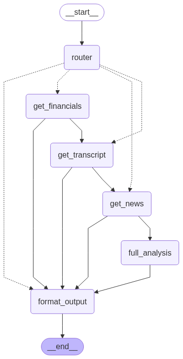

# Financial Agent
A comprehensive financial analysis tool that provides automated insights for stocks by analyzing multiple data sources including financial statements, earnings call transcripts, and recent news articles.

## Overview
This project implements an intelligent financial analysis system that combines web scraping, PDF processing, and AI-powered analysis to provide comprehensive investment insights. The system uses LangGraph to orchestrate different analysis workflows based on user queries.

## Features
- **Multi-Source Data Analysis**: Processes financial data from various publically available sources, earnings call transcripts, and news articles
- **Auto Query Routing**: Automatically determines the type of analysis needed based on user input
- **Transcript Processing**: analyzes PDF transcripts from earnings calls
- **News Aggregation**: analyzes recent news from news outlets using Tavily API
- **AI-Powered Insights**: Uses Google Gemini and Groq models for analysis
- **Workflow Orchestration**: LangGraph for complex analysis pipelines

### Analysis Types
1. **Financial Analysis**: Focus on financial ratios, metrics, and company performance
2. **News Analysis**: Sentiment analysis of recent news and market impact
3. **Transcript Analysis**: Earnings call insights and management commentary
4. **Full Analysis**: Comprehensive analysis combining all data sources

### Good to know
**This tool is for informational purposes only and should not be considered as financial advice. Always consult with qualified financial professionals before making investment decisions.**
